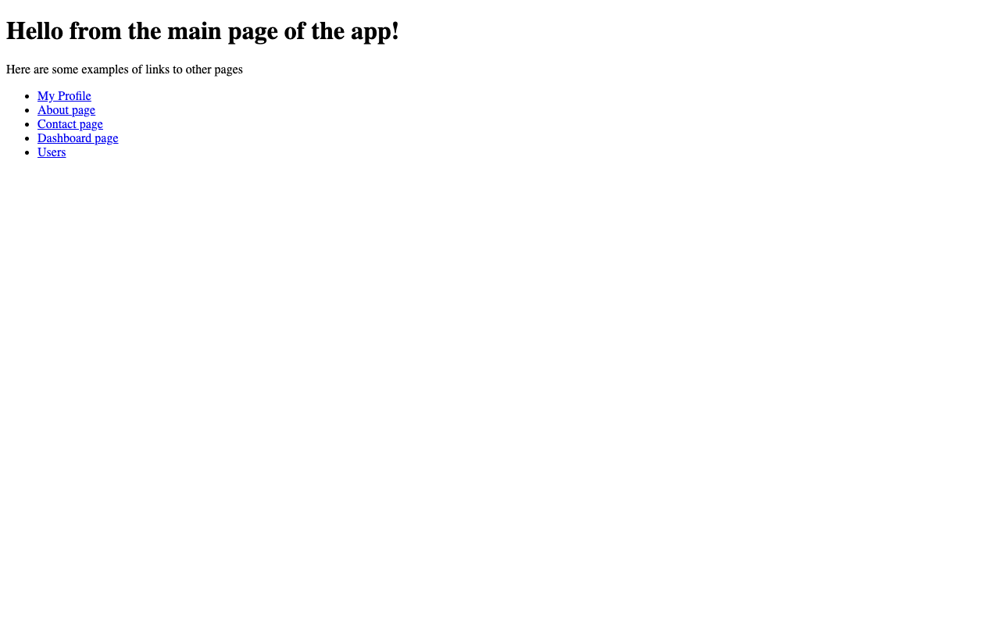

# init-react-app

A React + Vite scaffold built to practice **client-side routing with React Router**. The
home page links out to several routed pages (Profile, About, Contact, Dashboard, Users)
to exercise navigation and route configuration.



## Features

- React Router setup with multiple routes and navigation links.
- Vite dev server with fast HMR.
- Vitest + Testing Library configured for component tests.
- Utility libraries for data handling (`localforage`, `match-sorter`, `sort-by`).

## Tech stack

React · **Vite** · **React Router** · Vitest + Testing Library

## Getting started

```bash
npm install
npm run dev          # Vite dev server
```

Other scripts: `npm run build`, `npm run preview`, `npm test`, `npm run lint`.

## What I practiced

Wiring up **React Router** (routes, links, layout), bootstrapping a Vite project, and
configuring a component testing setup with Vitest. This is an early scaffold — the
routed pages are intentionally minimal while the focus was on routing mechanics.

## License

Odin Project coursework — original implementation by Aziz Umarov.
